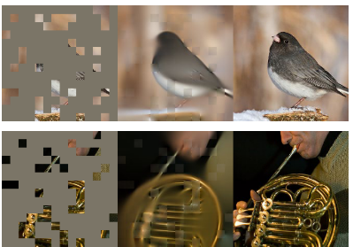

# Do we calcualte the loss only on the masked patches?

[MAE](https://arxiv.org/abs/2111.06377) uses only the masked patches to calculate loss. We guess the intution is to avoid overestimation of performance because the model has the access to the unmasked patches and supposed to be able to predict them easily. However, this is not the case in the real world. Our optimal model on XRF spectra shows it has really hard time to predict the unmasked patches while the masked parts are predicted with high accuracy (Figure 1). Actually, MAE has the same problem in images. Figure 2 shows the predicted pixels of the unmasked patches are having bad quality. Therefore, we decided to include all pathes in the loss calculation.

_optimal.png)
*Figure 1. Predicted and target spetra with masks.*

*Figure 2. Part of the example results from [MAE](https://arxiv.org/abs/2111.06377). For each triplet, it shows the masked image (left), recontructed image (middle), and the ground truth image (right).*